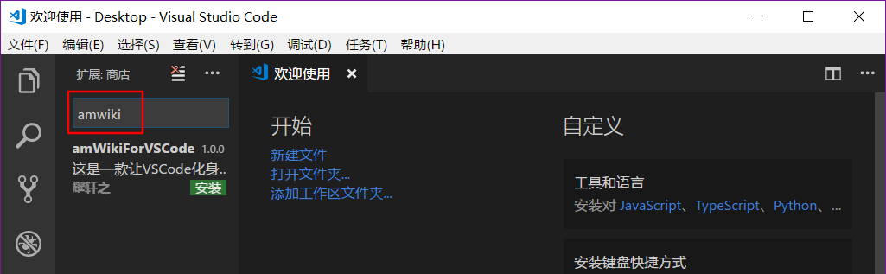
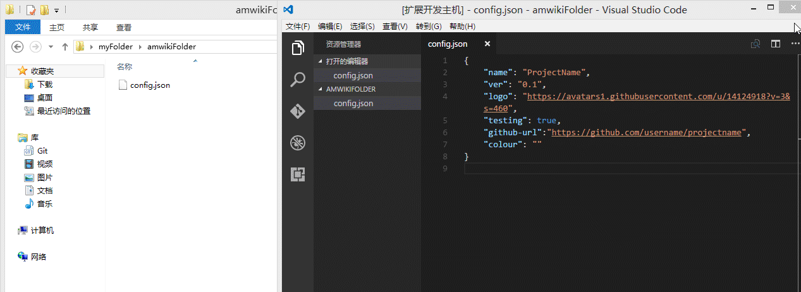
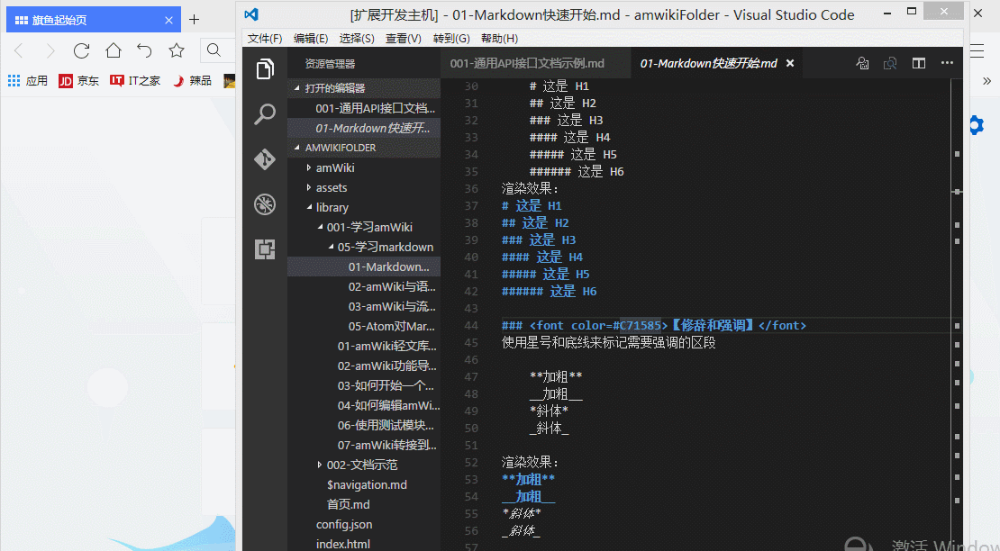

# 技术文档

## 开始一个新文库的步骤

1. ##### 下载 Microsoft 出品的开源文本编辑器 [Visual Studio Code](https://code.visualstudio.com/Download)，并安装  

2. ##### 安装 VSCode 完成之后，再安装插件 `amWikiForVSCode`，您可以通过以下三种途径安装：
    - 【方式】：通过 VSCode `扩展`菜单，搜索 `amWikiForVSCode` 并安装


3. ##### 在本地您需要创建文库的位置创建一个文件夹

4. ##### 在 VSCode 中 `文件` -> `将文件夹添加到工作区`，并指向刚创建的文件夹

5. ##### 在 VSCode 刚创建的项目下新建 `config.json` 文件，并按 json 格式配置以下属性，当然也可直接创建空文件不写内容：
    - **name**，您的文库名称，设置但为空或不设置将显示默认名
    - **ver**，文本版本号或维护者名号，设置但为空将不显示，注意诺不设置此属性将显示 amWiki 作者
    - **logo**，logo 的 url，设置但为空或不设置将显示默认 logo
    - **colour**，自定义颜色，默认为蓝色
    - **testing**，是否启用接口测试模块，默认值 false  
    - 更多配置参考 [amWiki - config.json 配置](http://amwiki.org/doc/?file=030-%E6%96%87%E6%A1%A3%E6%8A%80%E6%9C%AF%E7%AF%87/100-config%E9%85%8D%E7%BD%AE)
    - 例如：
    ```javascript
    {
        "name": "项目文档中心",
        "ver": "",
        "logo": "http://abc.com/logo.jpg",
    }
    ```
6. ##### 在 VSCode 菜单右键点击 `config.json`，“基于当前config.json创建wiki” ：


7. ##### 此时项目中自动创建了许多内容，其中 `library` 文件夹即为您的文库文件夹

## 文库目录结构
项目目录自动生创建的内容如下

    index.html                 // http 访问入口页面
    amWiki/                    // amWiki Web 端程序文件夹
    library/                   // 您的 Markdown 文库目录，所有文件必须使用 .md 格式
       ├ $navigation.md        // amWiki 文库目录导航文件，可自动/手动更新
       ├ 首页.md                // Web 端打开页面时页面页面默认显示的内容
       ├ 001-学习amWiki/        // Markdown 文件夹01
       │   ├ 001-关于amWiki     // 一些 Markdown 文档，支持二级目录
       │   └ 002-...
       ├ 002-文档示范/          // Markdown 文件夹02
       │   ├ 001-通用api        // 一些 Markdown 文档，支持二级目录
       │   └ 002-...
       └ 003-...               // 更多 Markdown 文件夹
    (assetes/)                 // 如果您粘帖截图，图片文件将自动创建在此处

## 如何使用
一键创建新文库后，在对应md文件中按下组合键`f12`或者使用文档编辑器的右键菜单中的`浏览当前页面`命令，然后，会自动打开默认浏览器来浏览当前markdown文件对应的页面，如下图所示：


更多，请阅读[amWiki 文档中心](http://amwiki.org/doc/?file=home-%E9%A6%96%E9%A1%B5)